# Delta-Resources-2021

---

## Table of Contents
- [Introduction](#introduction)
- [Proposal](#proposal)
- [Design](#design)
- [Journey](#journey)
- [Algorithms](#algorithms)
- [Software used](#software-used)
- [Competition Snaps](#competition-snaps)
- [Products used](#products-used)
- [Results](#results)
- [Prizes and Achievements](#prizes-and-achievements)
- [Team - DNS](#team---dns)
- [Mentors](#mentors)
- [Organizations](#organizations)
- [References](#references)

## Introduction
 
 - The **7th Delta International Smart & Green Manufacturing Contest** is themed "Seeking Smart IIoT Talents" and offered three tracks: "Innovative Machines", "Smart Factory", or "Better Future Living".
 - Our **Team DNS** took up the **Smart Factory track**, we were expected to present realistic solutions or approaches with digitalization, IIoT, and big data management for optimized production processes, high-efficiency management & production, enhanced safety & reliability, quality improvement, energy savings, predictive diagnosis and maintenance, and green solutions.
 - The Contest is **hosted by** the Chinese Association of Automation **(CAA)** and sponsored by the Chinese Association of Automation, and the Industry and Information Industry Vocational Education Teaching Steering Committee **under the Ministry of Education**. It is an innovative technology competition for automation, smart manufacturing solutions and green technology applications organized by the **Delta Group**.

## Proposal
- Our Team DNS proposed the Pick Sort Place Bot
- So after researching on some trends and practices currently followed in the packaging industry, we noticed that there were shortcomings in case of:
  * Variable sized item packaging
  * Location based item packaging
  * Custom subscription box based packaging
- And we took to solving that with our [proposed idea](https://github.com/SRA-VJTI/Delta2021/blob/main/docs/proposal/delta2021090_PSP_Bot_Proposal.pdf)

## Design
The complete mechanical structure is designed in **Solidworks2021**. Dimensions, assemblies and sub-parts were finalised considering the following:
* Material Strength
* Stress, material and displacement analysis
* Material Availability

### Manufactured Product
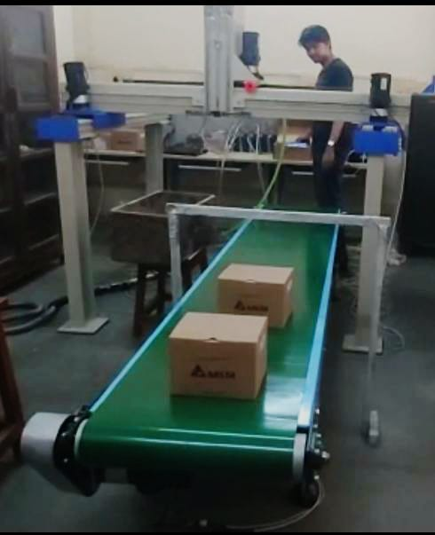

### Raw Frame 
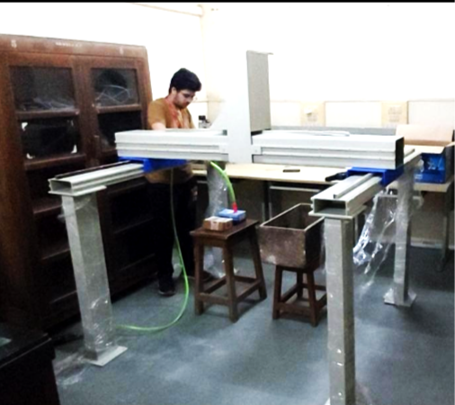

### Structure with Conveyor Setup
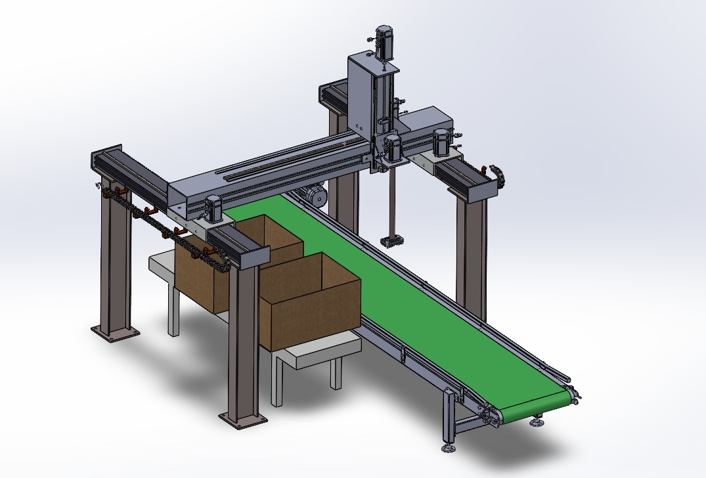

### XYZ Gantry Frame
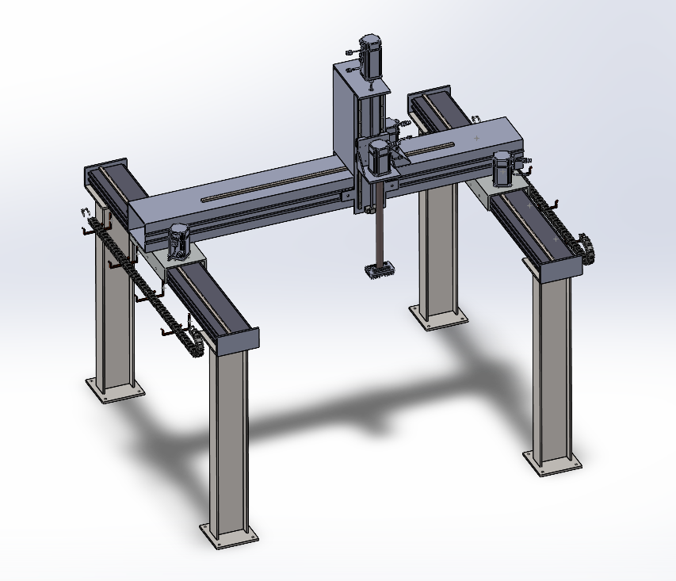

## Journey

## Algorithms
We are trying to implement a 3D binary packaging algorithm to reduce wastage of space ensuring efficient packaging of input items in output containers.
<table>
<tr>                   
<td>

### Loose Input Items
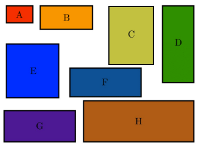</tc>
<td>

### Close Packaging
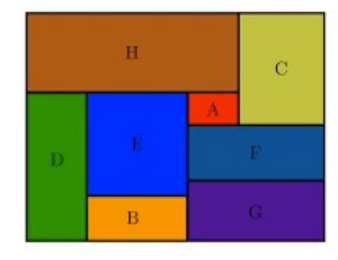</td>
</tr>
<tr>

### 3D Packaging
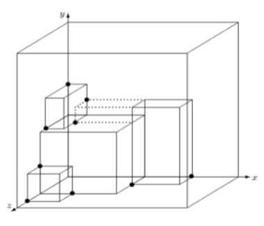</tr>
</table>

## Software used
1. **Delta's CANopen** - To program the PLC Motion Controller. Currently, **ladder** language was used for programming.
2. **DOPsoft** - To design and program the Human Machine Interface - HMI.

## Competition Snaps
### X Y Axis Motion

## Products Used
### 1. PLC - Motion Controller 
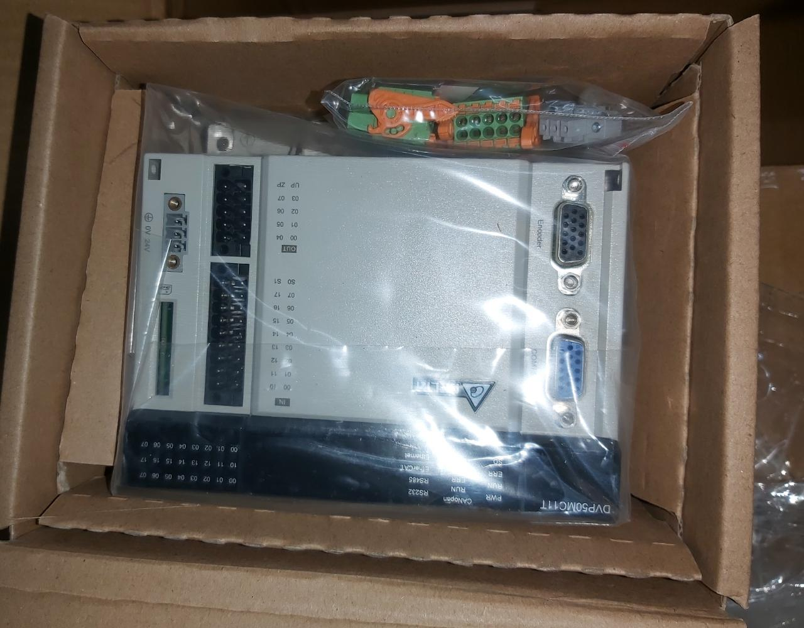

### 2. Conveyor Belt System
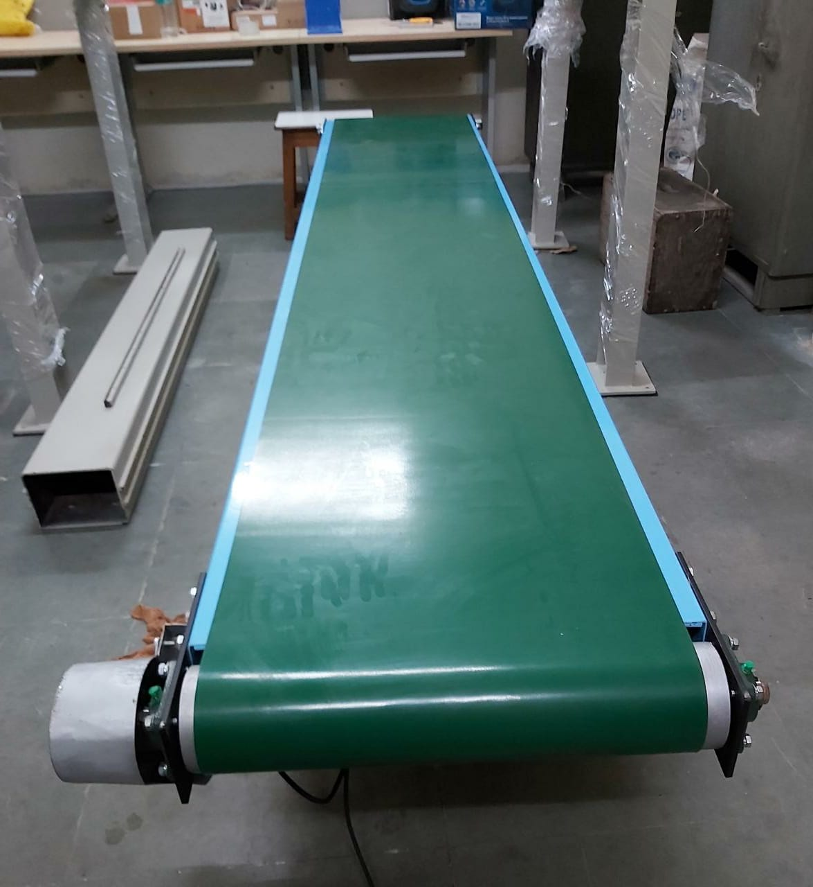

### 3. Machine Vision Lens and System
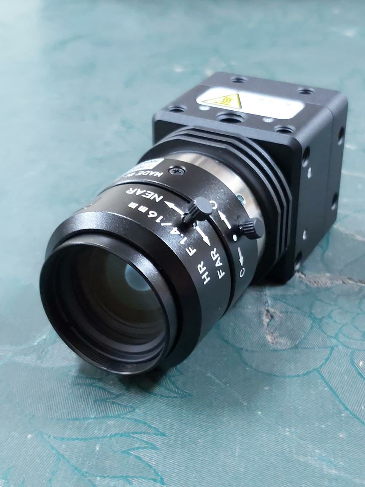

### 4. AC Servo Motor
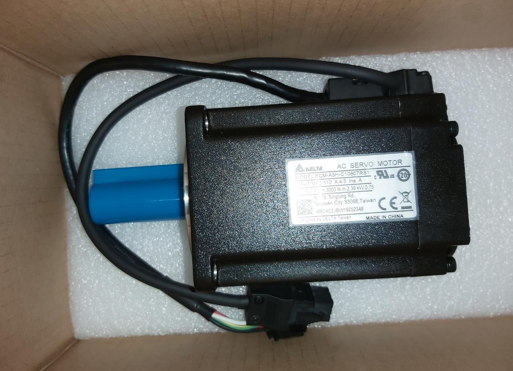

### 5. Servo Drives
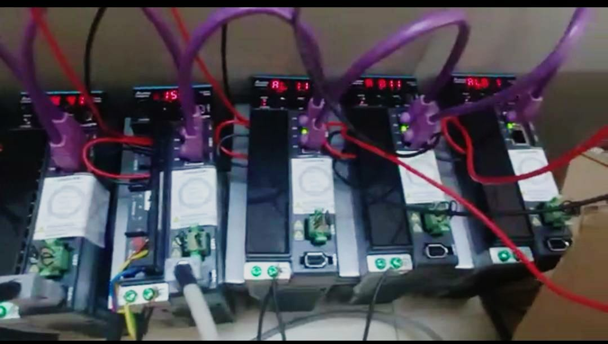

### 6. IIoT Router
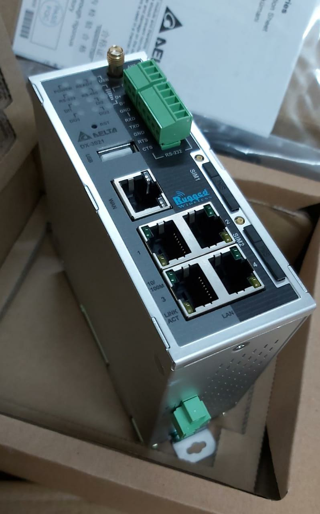

### 7. HMI - Human Machine Interface
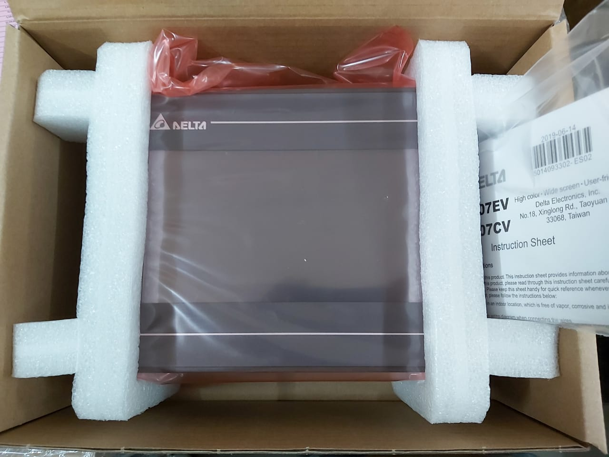

### 8. Laser Displacement Sensor
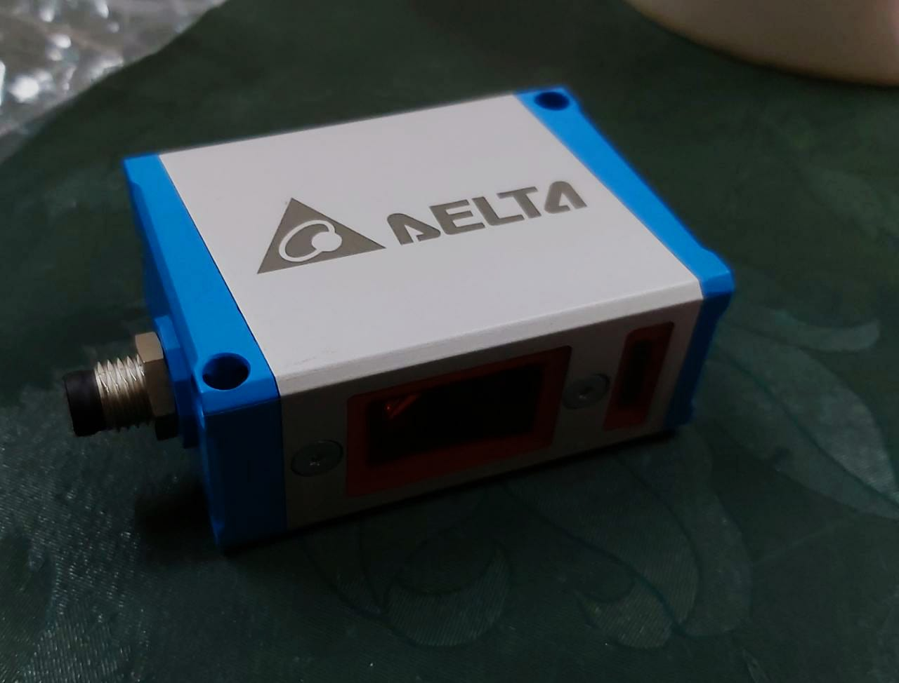

## Results
- Representing India, Team DNS and VJTI bagged a rank under **Top 40** globally winning the **Second Prize** category.
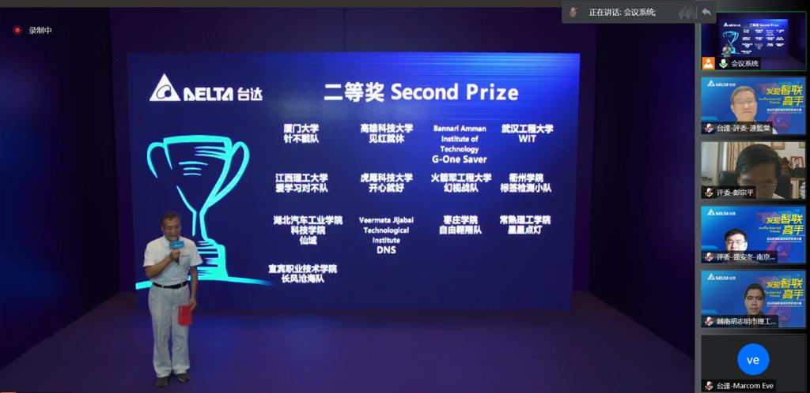
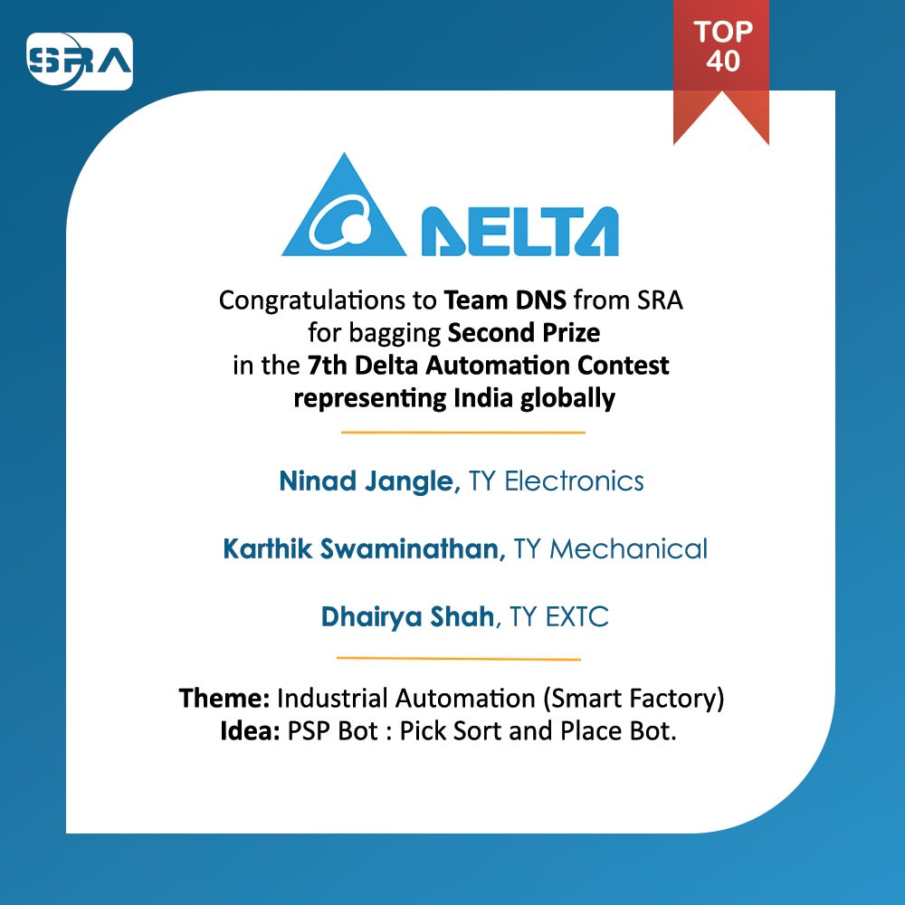

## Prizes and Achievements
1. Trophy Shield - Second Prize category
2. Delta's Industrial Automation Products Worth Rs 16.8 lakhs free of cost
3. 3000 RMB Cash Prize

## Team - DNS
- [Dhairya Shah](https://github.com/dhairyashah1/)
- [Karthik Swaminathan](https://github.com/kart1802/)
- [Ninad Jangle](https://github.com/ninja3011/)

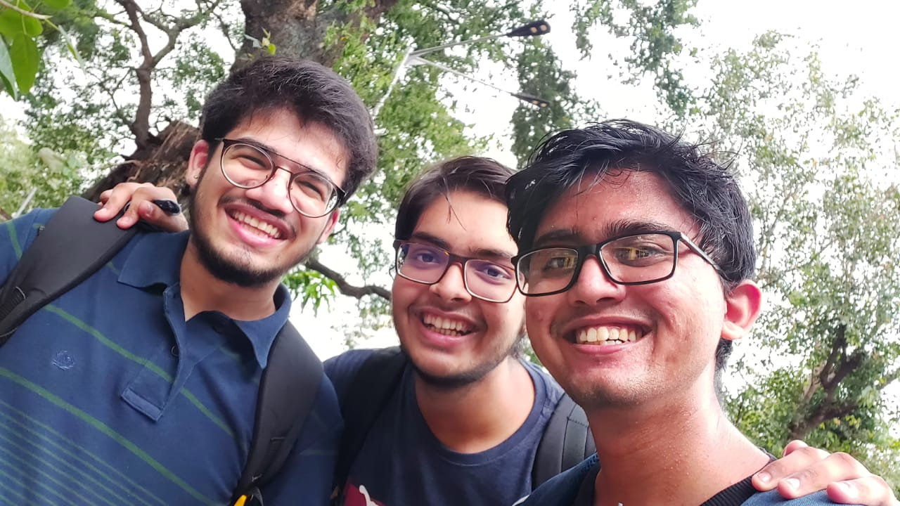

## Mentors
- [Dr. Faruk Kazi](https://www.linkedin.com/in/dr-faruk-kazi-vjti/?originalSubdomain=in)
- [Mr. Alister D'Silva](https://www.linkedin.com/in/alister-dsilva/)
- [Omkar Bhilare](https://www.linkedin.com/in/omkar-bhilare-985aa2180/)

## Organizations
- [VJTI](https://www.vjti.ac.in/)
- [SRA-VJTI](https://sravjti.in/)
- [COE-VJTI](https://www.vjti.ac.in/images/coe-cnds/project/index.html)
- [Absolute Motion Pvt Ltd](https://absolutemotion.in/)

## References

1. [Introductory Video](https://youtu.be/Td_gTH8elXg)
2. [Journey and Demo Video](https://youtu.be/JBdjbeT3EMY)
3. [Demo Video](https://youtu.be/Td_gTH8elXg)
4. [PSP BOT Presentation](https://github.com/SRA-VJTI/Delta2021/blob/main/docs/presentation/presentation.pdf)

